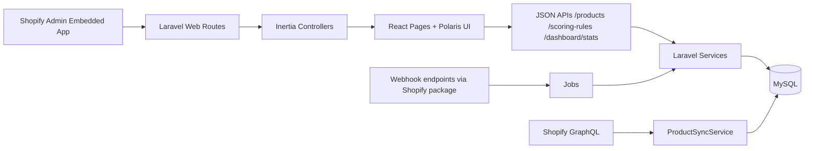

# Swishtag Project - Full Technical Documentation

## 1. Project Overview

Swishtag Project is a Shopify embedded app built with Laravel + Inertia + React + Polaris. Its active business focus is a Dynamic Product Scoring Engine:

- Sync Shopify products into a local database.
- Score products using configurable scoring rules.
- Show product risk/priority levels (Low, Medium, High, Critical).
- Provide a merchant-facing dashboard for scoring operations.
- Provide a dedicated Scoring Rules management page.

The app includes legacy Orders infrastructure (models, jobs, repositories) that still exists in code but is not part of the active navigation flow.

## 2. Technology Stack

### Backend

- PHP: ^8.2
- Laravel: ^12.0
- Inertia server adapter: inertiajs/inertia-laravel ^2.0
- Shopify package: kyon147/laravel-shopify 23.0
- Auth/session API helper: laravel/sanctum ^4.0
- Ziggy route helper: tightenco/ziggy ^2.0

### Frontend

- React 18
- Inertia React adapter: @inertiajs/react ^2.0.17
- Polaris: @shopify/polaris ^13.9.5
- Polaris icons: @shopify/polaris-icons ^9.3.1
- Vite 7 + @vitejs/plugin-react

### Database / Queue

- MySQL (project expectation)
- Queue configured in env for Redis (QUEUE_CONNECTION=redis in current .env.example)

## 3. High-Level Architecture

## 4. Runtime Request Model

### 4.1 Embedded auth and middleware

Primary app routes are in `verify.embedded` + `verify.shopify` middleware group.

- `verify.embedded` checks for `shop` query and redirects to `login` when missing.
- `verify.shopify` is provided by the Shopify package.

### 4.2 Inertia root view switching

`HandleInertiaRequests` sets root view:

- Embedded requests (with `shop`) -> `resources/views/embedded.blade.php`
- Non-embedded requests (without `shop`) -> `resources/views/non_embedded.blade.php`

### 4.3 Global fetch interceptor for embedded app

`embedded.blade.php` monkey-patches `window.fetch` to always append:

- `Accept: application/json`
- `Authorization: Bearer <shopify idToken>`

This is why most frontend fetch calls do not manually add auth headers.

## 5. Entry Points and Navigation

### 5.1 Application boot

Frontend boot file: `resources/js/app.jsx`

- Loads Polaris styles.
- Wraps app with Polaris `AppProvider` (English locale).
- Uses Inertia dynamic resolver:
  - `resolvePageComponent('./Pages/${name}.jsx', import.meta.glob('./Pages/**/*.jsx'))`

### 5.2 Embedded nav menu

`resources/views/embedded.blade.php` nav:

- Product Scoring (`/scoring`) as home
- Product Analytics (`/products-analytics`)
- Scoring Rules (`/scoring-rules-page`)

## 6. Routes Inventory

Current route inventory was verified with `php artisan route:list`.

### 6.1 Core app web routes

- `GET /` -> `ProductScoringDashboardController@index` (name: `home`)
- `GET /scoring` -> `ProductScoringDashboardController@index` (name: `scoring`)
- `GET /products-analytics` -> `ProductScoringDashboardController@analyticsPage` (name: `products-analytics.page`)
- `GET /scoring-rules-page` -> `ProductScoringDashboardController@rulesPage` (name: `scoring-rules.page`)

### 6.2 Product and scoring API routes (web middleware, JSON responses)

- `POST /products/sync` -> `ProductSyncController@store` (`products.sync`)
- `GET /products` -> `ProductController@index` (`products.index`)
- `GET /products/{id}` -> `ProductController@show` (`products.show`)
- `POST /products/{id}/recalculate-score` -> `ProductScoreController@recalculate` (`products.recalculate-score`)
- `POST /scores/recalculate-all` -> `ProductScoreController@recalculateAll` (`scores.recalculate-all`)
- `GET /dashboard/stats` -> `DashboardStatsController@index` (`dashboard.stats`)

### 6.3 Scoring rule API routes

- `GET /scoring-rules` -> `ScoringRuleController@index` (`scoring-rules.index`)
- `POST /scoring-rules` -> `ScoringRuleController@store` (`scoring-rules.store`)
- `PUT /scoring-rules/{id}` -> `ScoringRuleController@update` (`scoring-rules.update`)
- `DELETE /scoring-rules/{id}` -> `ScoringRuleController@destroy` (`scoring-rules.destroy`)

### 6.4 Package and auth routes also present

- Shopify package auth/billing/webhook endpoints (`authenticate`, `billing/*`, `webhook/{type}`, `api/*`)
- Breeze auth routes (`login`, `register`, `password/*`, `verify-email/*`, etc.)

## 7. Feature Modules

## 7.1 Product Scoring Dashboard

Frontend: `resources/js/Pages/Embedded/Products/Index.jsx`

Shared UI components used by this page:

- `resources/js/Components/Scoring/DashboardStatCard.jsx`
- `resources/js/Components/Scoring/InsightCard.jsx`
- `resources/js/Components/Scoring/PriorityBadge.jsx`
- `resources/js/Components/Scoring/ScoreIndicator.jsx`

Primary capabilities:

- Stats overview cards.
- Top-5 attention table with Polaris `IndexTable`.
- Sync products button.
- Recalculate all scores button.
- Per-product actions:
  - View details modal
  - Recalculate one product
  - Open in Shopify admin

Current role (summary-focused):

- Overview stats cards
- Insight cards
- Only top 5 highest-risk products
- CTA button to open full analytics page (`View all products`)

Notable UI behavior:

- Uses `useSetIndexFiltersMode` for Polaris filter mode handling.
- Includes custom CSS overrides to hide top IndexTable horizontal scrollbar visuals.
- Pagination text summary line was intentionally removed in recent edits.

## 7.2 Product Score Detail Modal

Frontend: `resources/js/Pages/Embedded/Products/ScoreDetailModal.jsx`

- Fetches `GET /products/{id}` for full detail.
- Displays score card, level badge, reasons, recommendations, history table.
- Supports single-product score recalculation action.
- Uses shared score UI primitives (`PriorityBadge`, `ScoreIndicator`) for consistent styling.

## 7.3 Product Analytics Page

Frontend: `resources/js/Pages/Embedded/Products/Analytics.jsx`

- Full searchable/filterable/sortable/paginated products table.
- Filters for priority level, product status, vendor, and inventory issue.
- Analytics cards/graphs for:
  - score distribution
  - products needing attention
  - most common scoring reasons
  - average score / unscored products
  - last sync / last scoring timestamps
- Preserves product action menu:
  - View details
  - Recalculate score
  - Open in Shopify admin

Shared table component:

- `resources/js/Components/Products/ProductTable.jsx`

## 7.4 Scoring Rules Management

Frontend: `resources/js/Pages/Embedded/ScoringRules/Index.jsx`

- Rules overview summary cards.
- Insight cards for rule health, source split, and pending recalculation state.
- Rule list table with select, edit, activate/deactivate, delete/disable actions.
- Create/edit modal (`RuleFormModal`).
- Delete/disable confirmation modal.
- Polaris `IndexFilters` search/sort/filter UI.
- Uses explicit `cancelAction` on `IndexFilters` to ensure visible Cancel behavior.
- Includes custom CSS overrides to hide top IndexTable scrollbar visuals.

## 8. Backend Controllers and Responsibilities

### `ProductScoringDashboardController`

- Renders Inertia pages only.
- `index()` -> `Embedded/Products/Index`
- `analyticsPage()` -> `Embedded/Products/Analytics`
- `rulesPage()` -> `Embedded/ScoringRules/Index`

### `ProductController`

- `index()` returns paginated products with filtering/sorting.
- `show()` returns one product + score info + last 10 logs.
- Uses `ProductResource`.

Important note:

- Current `index()` default pagination is `per_page=10` unless overridden, despite older comments mentioning 25.
- Supports additional optional filter `inventory_issue` (`out_of_stock`, `low_stock`, `no_issue`).
- Vendor filtering uses partial matching.
- Score sorting includes deterministic tie-break ordering by latest update/sync timestamp.

### `ProductSyncController`

- Manual sync endpoint.
- Runs sync synchronously via `ProductSyncService`.
- Returns JSON success/error counts.

### `ProductScoreController`

- Single product rescore endpoint (sync execution).
- Full shop rescore endpoint (sync execution in chunks).
- Returns immediate JSON feedback.

### `DashboardStatsController`

- Aggregates scoring stats and timestamps for dashboard cards.
- Uses `products.score_breakdown IS NULL` to detect unscored products.
- Also returns analytics fields:
  - `out_of_stock_products`
  - `low_inventory_products`
  - `top_scoring_reasons` (top 5)

### `ScoringRuleController`

CRUD for scoring rules with global override logic:

- Lists global + shop-specific rules.
- Creates shop-scoped rules.
- Updating global rule clones it into shop-specific copy.
- Deleting global rule creates disabled shop-specific copy.
- Deleting shop-owned rule hard deletes it.

## 9. Core Services

## 9.1 `ProductSyncService`

Purpose:

- Pulls products from Shopify GraphQL in pages.
- Upserts local `products` rows.
- Upserts local `product_varients` rows.

Key behavior:

- Page size currently 50.
- Uses `user_id + shopify_product_id` as idempotent upsert key.
- Denormalizes min price, total inventory, and image URL onto `products`.

## 9.2 `ProductScoringService`

Purpose:

- Evaluates active rules against a product.
- Computes total score and reasons.
- Persists current score and appends score logs.
- Updates denormalized score cache on `products`.

Score levels:

- `critical`: >= 101
- `high`: 61-100
- `medium`: 31-60
- `low`: 0-30

Supported operators:

- `equals`
- `not_equals`
- `less_than`
- `greater_than`
- `older_than_days`
- `empty`
- `not_empty`
- `contains`

Rule type -> field map:

- `status` -> `products.status`
- `price` -> `products.price`
- `inventory` -> `products.inventory_quantity`
- `recency` -> `days since products.shopify_updated_at`
- `tags` -> `products.tags`
- `image` -> `products.image_url`
- `description` -> `products.body_html`
- `vendor` -> `products.vendor`

## 10. Domain Models

### Active scoring models

- `App\Models\Products\Product`
- `App\Models\ScoringRule`
- `App\Models\Products\ProductScore`
- `App\Models\Products\ProductScoreLog`

### User/shop model

- `App\Models\User` implements Shopify package `ShopModel` contract.

### Legacy orders domain still present

- `App\Models\Orders\*`
- `App\Repositories\Order*`
- related jobs

These are part of the codebase but not exposed in active top-level nav.

## 11. API Resources (JSON Shapes)

- `ProductResource`
- `ProductScoreResource`
- `ProductScoreLogResource`
- `ScoringRuleResource`

Important behavior:

- `ProductResource` conditionally includes `score_info` and `score_logs` via `whenLoaded`.
- `ScoringRuleResource` computes `is_global` from `shop_id === null`.

## 12. Database Schema Summary

### Products

Created in `2025_05_26_133026_create_products_table.php`, then expanded by later migrations.

Important columns:

- identity/shop: `id`, `user_id`, `shopify_product_id`
- product metadata: `title`, `handle`, `body_html`, `tags`, `vendor`, `product_type`, `status`
- scoring/denorm: `score`, `score_breakdown`, `price`, `inventory_quantity`, `image_url`
- timestamps: `shopify_created_at`, `shopify_updated_at`, `synced_at`, `created_at`, `updated_at`, `deleted_at`

Constraints:

- unique: `(user_id, shopify_product_id)`

### Product variants

- table: `product_varients`
- key columns: `product_id`, `shopify_product_varient_id`, `price`, `inventory_quantity`, etc.

### Product media

- table: `product_media`
- key columns: `product_id`, `shopify_product_media_id`, `src`, `position`

### Scoring rules

- table: `scoring_rules`
- key columns: `shop_id`, `rule_name`, `rule_key`, `rule_type`, `condition_operator`, `condition_value`, `points`, `is_active`, `sort_order`

### Current product score

- table: `product_scores`
- one score row per `(shop_id, product_id)`

### Score logs

- table: `product_score_logs`
- append-only score history snapshots

### Migration fix note

`2026_05_20_000001_fix_products_column_lengths.php` changed:

- `products.tags` to `TEXT`
- `products.image_url` to `TEXT`

Reason: prevent data truncation from long Shopify tags/image URLs.

## 13. Jobs and Async Landscape

### Current/important jobs

- `SyncShopifyProductsJob`
- `CalculateProductScoreJob`
- `RecalculateAllProductScoresJob`
- `ProductsUpdateJob` (webhook-driven updates)

### Legacy jobs still present

- `ProductSyncJob`, `ProductsCreateJob`, `ProductsDeleteJob`
- orders jobs (`OrderSyncJob`, `OrdersCreateJob`, etc.)
- `InventoryLevelsUpdateJob`, `AppUninstalledJob`

Current UI actions for sync/rescore are mostly synchronous via controllers and services; job infrastructure remains available.

## 14. Validation and Requests

Scoring rule request validators:

- `StoreScoringRuleRequest`
- `UpdateScoringRuleRequest`

They enforce:

- allowed rule types/operators
- points numeric range (-10000 to 10000)
- conditional requirement of `condition_value`

## 15. Configuration and Environment

## 15.1 Notable env variables

Core:

- `APP_URL`, `APP_ENV`, `APP_DEBUG`
- `DB_*`
- `QUEUE_CONNECTION`

Shopify:

- `SHOPIFY_API_VERSION`
- `SHOPIFY_API_KEY`
- `SHOPIFY_API_SECRET`
- `SHOPIFY_API_SCOPES`
- `SHOPIFY_APPBRIDGE_ENABLED`
- `SHOPIFY_BILLING_ENABLED`

Webhooks (in `.env.example`):

- `SHOPIFY_WEBHOOK_1_TOPIC` ... `SHOPIFY_WEBHOOK_8_TOPIC`
- corresponding `SHOPIFY_WEBHOOK_*_ADDRESS`

## 15.2 Shopify package config

`config/shopify-app.php` controls:

- route names and route behavior
- API version, key/secret/scopes
- billing toggles
- package route registration

## 16. Build, Run, and Test Commands

Install:

- `composer install`
- `npm install`

Migrate:

- `php artisan migrate`

Run local app:

- `php artisan serve`
- `npm run dev`

Build frontend:

- `npm run build`

Run tests:

- `php artisan test`
  - test suites currently mostly default Breeze scaffolding tests.

Route inspection:

- `php artisan route:list`

## 17. Security and Auth Notes

- App routes use Shopify verification middleware.
- Embedded fetch interceptor injects bearer token from App Bridge context.
- CSRF validation is globally excepted in `bootstrap/app.php` (`*`) for web middleware, which is a significant security tradeoff and should be reviewed.

## 18. Logging and Observability

Key logs are written for:

- sync start/finish and per-item failures
- scoring execution and rule matches
- webhook processing
- rule CRUD operations

Primary log file:

- `storage/logs/laravel.log`

## 19. Known Technical Debt / Important Notes

1. Product controller default `per_page` currently defaults to 10 while historical comments in code/docs referenced 25.
2. Orders domain code remains in repository but active navigation/feature focus is product scoring.
3. `User` model import for product namespace uses lowercase `app\Models\Products\Product` in source; review for consistency.
4. Legacy trait/repository paths remain active in some webhook jobs; service-based sync/scoring also exists.
5. Global CSRF except configuration should be carefully validated for production risk posture.

## 20. File Map (Most Important)

### Frontend

- `resources/js/app.jsx`
- `resources/js/Components/Products/ProductTable.jsx`
- `resources/js/Components/Scoring/DashboardStatCard.jsx`
- `resources/js/Components/Scoring/InsightCard.jsx`
- `resources/js/Components/Scoring/PriorityBadge.jsx`
- `resources/js/Components/Scoring/ScoreIndicator.jsx`
- `resources/js/Pages/Embedded/Products/Index.jsx`
- `resources/js/Pages/Embedded/Products/Analytics.jsx`
- `resources/js/Pages/Embedded/Products/ScoreDetailModal.jsx`
- `resources/js/Pages/Embedded/ScoringRules/Index.jsx`
- `resources/views/embedded.blade.php`

### Backend

- `routes/web.php`
- `app/Http/Controllers/ProductScoringDashboardController.php`
- `app/Http/Controllers/ProductController.php`
- `app/Http/Controllers/ProductSyncController.php`
- `app/Http/Controllers/ProductScoreController.php`
- `app/Http/Controllers/DashboardStatsController.php`
- `app/Http/Controllers/ScoringRuleController.php`

### Services

- `app/Services/ProductSyncService.php`
- `app/Services/ProductScoringService.php`

### Models

- `app/Models/User.php`
- `app/Models/ScoringRule.php`
- `app/Models/Products/Product.php`
- `app/Models/Products/ProductScore.php`
- `app/Models/Products/ProductScoreLog.php`

### Data layer

- `database/migrations/*`
- `app/Http/Resources/*`
- `app/Http/Requests/*`

## 21. End-to-End Functional Flow

### Sync and score journey

1. Merchant opens Product Scoring page.
2. Merchant clicks Sync Products.
3. `POST /products/sync` runs `ProductSyncService`.
4. Local product rows and variants are upserted.
5. Merchant triggers score recalculation (single/all).
6. `ProductScoringService` applies active rules.
7. Writes to `product_scores`, `product_score_logs`, and `products.score` cache.
8. Dashboard list/stats refresh and display updated levels and reasons.

### Rule modification journey

1. Merchant creates/edits/deletes rule in Scoring Rules page.
2. `ScoringRuleController` persists change with global override rules.
3. UI shows "rules changed" recalculation prompt.
4. Merchant runs recalculate-all to apply new rule set to products.

## 22. Maintenance Checklist

- Keep Shopify API version current in env/config.
- Re-run migrations after pulling schema changes.
- Validate webhook endpoints and scopes whenever topics change.
- Review performance of sync/scoring on large catalogs.
- Keep frontend Polaris APIs aligned with installed Polaris version.
- Review CSRF and auth hardening before production deployment.

## 23. Latest Polaris UI Redesign (Current Session)

Scope completed:

- Redesigned Product Scoring Dashboard UI in `resources/js/Pages/Embedded/Products/Index.jsx`.
- Redesigned Scoring Rules page UI in `resources/js/Pages/Embedded/ScoringRules/Index.jsx`.
- Refined Score Detail Modal UI in `resources/js/Pages/Embedded/Products/ScoreDetailModal.jsx`.
- Added shared scoring presentation components under `resources/js/Components/Scoring/*`.

Key UX improvements:

- Stronger overview hierarchy with reusable stat cards and clearer helper copy.
- Added insight widgets to both dashboard and rules page for action-focused context.
- Improved loading and error states (skeletons + retry actions where applicable).
- Improved consistency of score visualization and priority badges across screens.
- Preserved prior table usability customizations (filters, selection, pagination behavior, hidden top scroll chrome).

Backend compatibility:

- No backend route, API contract, service logic, or migration changes were made.
- Existing endpoints consumed by the redesigned frontend remain unchanged.

Verification checklist (completed):

- `npm run build` passed successfully after redesign.
- VS Code diagnostics (`get_errors`) returned no errors for edited frontend files.

Edited files in this redesign:

- `resources/js/Components/Scoring/DashboardStatCard.jsx`
- `resources/js/Components/Scoring/InsightCard.jsx`
- `resources/js/Components/Scoring/PriorityBadge.jsx`
- `resources/js/Components/Scoring/ScoreIndicator.jsx`
- `resources/js/Pages/Embedded/Products/Index.jsx`
- `resources/js/Pages/Embedded/Products/ScoreDetailModal.jsx`
- `resources/js/Pages/Embedded/ScoringRules/Index.jsx`
- `docs/PROJECT_DOCUMENTATION.md`

## 24. Top-5 Dashboard and Product Analytics Expansion

Scope completed:

- Main dashboard (`/scoring`) now focuses on summary + top attention items.
- Added new dedicated analytics page (`/products-analytics`) for full product exploration.
- Added embedded navigation entry for the analytics page.

Behavior changes:

- Dashboard products section now shows only top 5 products needing attention.
- Dashboard query uses `/products` with:
  - `per_page=5`
  - `sort_by=score`
  - `sort_direction=desc`
- Tie-break sorting for equal scores uses latest `shopify_updated_at/synced_at`.
- Added `View all products` CTA on dashboard to open analytics page.

Analytics page features:

- Full table with search, sorting, and pagination.
- Filters:
  - priority level
  - status
  - vendor
  - inventory issue
- Analytics sections:
  - score distribution bars
  - products needing attention
  - most common scoring reasons
  - average/unscored/last sync/last score metadata

Backend/API safety status:

- Existing routes retained:
  - `GET /products`
  - `GET /products/{id}`
  - `POST /products/sync`
  - `POST /scores/recalculate-all`
  - `POST /products/{id}/recalculate-score`
  - `GET /dashboard/stats`
  - scoring-rules CRUD routes
- Only one new route added: `GET /products-analytics`.

Verification completed:

- `npm run build` passed after implementation.
- New route is registered (`php artisan route:list --name=products-analytics.page`).
- VS Code diagnostics reported no errors in edited files.

---

If you want, this document can be split into:

- `docs/01-architecture.md`
- `docs/02-api-reference.md`
- `docs/03-frontend-guide.md`
- `docs/04-operations-runbook.md`

for easier long-term maintenance.
